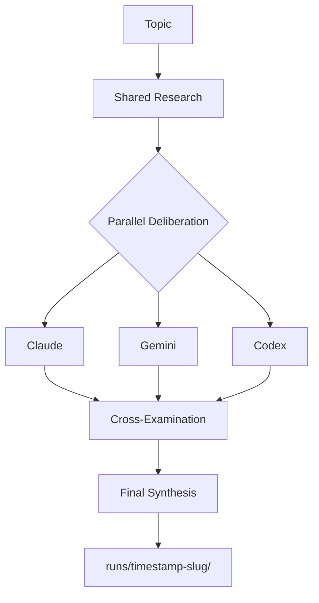

# Accord — Multi-Agent Debates That Commit to Your Repo

[](https://github.com/alemora-dev/accord-cli/releases)
[](LICENSE)
[](https://github.com/alemora-dev/accord-cli)

**Permanent architectural decisions, not ephemeral chat opinions.**

Accord runs a council of AI agents on any topic and writes the full debate — research, opinions, cross-examination, synthesis — as Markdown files you can commit to your repository. No Python. No runtime. One command.

---

## Why Accord

| | Accord | Ephemeral assistants |
|---|---|---|
| **Output** | Permanent `.md` files in `runs/` | Disappears when you close the chat |
| **Install** | `curl -sSL https://get.accord.sh \| bash` | Python 3.10+ + uv + manual config |
| **Runtime** | Zero — single binary | Requires runtime |
| **LLMs** | Any CLI (codex, claude, gemini, custom) | Platform-specific |
| **Teams** | Built-in specialist presets | Generic assistant |
| **Open** | Edit prompts directly in `src/prompts/` | Black box |

---

## Quick Start

```bash
# Install (macOS / Linux)
curl -sSL https://get.accord.sh | bash

# Run a debate
accord "Should we migrate to a microservices architecture?"

# Use a specialist team
accord --team security "Review the new authentication flow"
accord --team architecture "Evaluate the trade-offs of using Bun vs Node.js"
```

---

## How It Works



Five stages, all written to `runs/<timestamp>-<slug>/`:

1. **Shared Research** — coordinator does one web-research pass
2. **Understanding** — each debater extracts key facts
3. **Opinion** — each debater gives an initial answer
4. **Cross-Examination** — each debater reads peer opinions and revises
5. **Final Synthesis** — coordinator writes the definitive summary

---

## Specialist Teams

```bash
accord --team security  "Evaluate the new login system"
accord --team architecture "Assess the proposed monorepo structure"
accord --team performance "Review the database query patterns"
accord --team debug "Why is the payment service timing out?"
```

Each team injects a specialist persona into every debater stage. No new pipeline stages, no new config.

---

## Artifacts

Every run writes a self-contained folder:

```
runs/
└── 2026-04-06T12-00-00Z-should-we/
    ├── should-we_research_1.md
    ├── should-we_claude_understanding_1.md
    ├── should-we_claude_opinion_1.md
    ├── should-we_claude_debate_1.md
    ├── should-we_gemini_understanding_1.md
    ├── should-we_gemini_opinion_1.md
    ├── should-we_gemini_debate_1.md
    ├── should-we_final_1.md
    └── run_summary.md
```

Commit `runs/` to your repository. Review it in pull requests. Reference it in your ADRs.

---

## Configuration

Custom providers via `.accordrc`:

```bash
ACCORD_PROVIDERS=writer,critic
ACCORD_PROVIDER_WRITER_STYLE=codex
ACCORD_PROVIDER_WRITER_BIN=codex
ACCORD_PROVIDER_CRITIC_STYLE=gemini
ACCORD_PROVIDER_CRITIC_BIN=gemini
ACCORD_LLMS=writer:coordinator,critic:debater
```

Role-based runs:

```bash
accord --llms codex:coordinator,claude:debater,gemini:debater "Best browser automation workflows"
```

---

## Development

```bash
# Run tests
bun test

# Build binaries
bun run scripts/build.ts

# Run from source
bun run src/main.ts "Topic"
```

Core docs: [`docs/architecture.md`](docs/architecture.md)

---

> *"Reliability comes from engineering discipline, not better prompts."*
