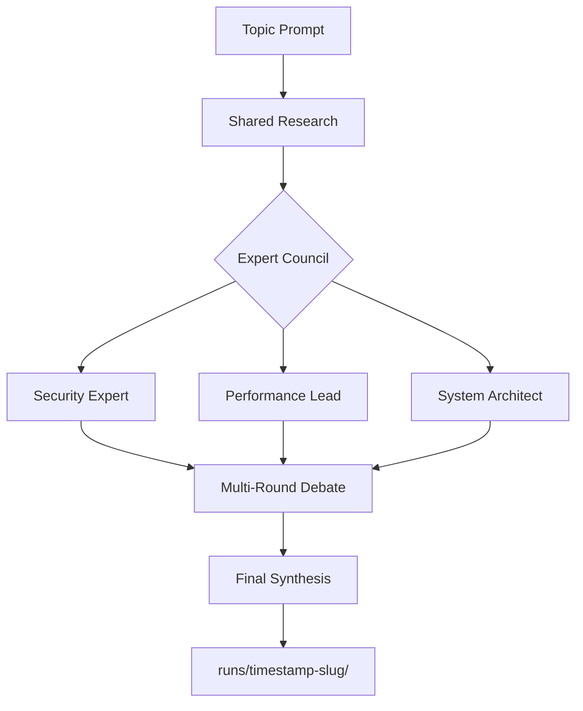

# Accord v2 — The Engineering-Grade Multi-Agent Council

[](https://github.com/alemora-dev/accord-cli)
[](LICENSE)

**Professional Architectural Decision Records (ADRs), not just ephemeral chat opinions.**

Accord is a high-reliability orchestrator for local multi-agent debates. It turns LLM disagreement into verifiable, auditable project artifacts. While other tools give you a "second opinion" that disappears when you close your chat, Accord generates a permanent paper trail you can commit to your repository.

---

## 🏗️ How it Works

Accord orchestrates a "Council" of diverse AI experts to stress-test your ideas.



1. **Shared Research:** A coordinator (Claude/Gemini) performs a ground-truth research pass.
2. **Parallel Deliberation:** Multiple expert "Personas" analyze the research independently.
3. **Cross-Examination:** Agents read peer opinions and revise their positions or critique others.
4. **Final Synthesis:** A comprehensive summary is generated, highlighting consensus and risks.
5. **Artifact Generation:** Every run writes a full set of Markdown documents to your local `runs/` folder.

---

## 🚀 Why Accord?

| Feature | Accord-CLI | Ephemeral Assistants |
| :--- | :--- | :--- |
| **Auditability** | Permanent `.md` files in your repo | Disappears in chat history |
| **Reliability** | TypeScript async/await (v2) | Prone to "yes-man" bias |
| **Personas** | Specialist roles (Security, Perf, etc.) | Generic "AI Assistant" |
| **KISS** | Single binary, zero dependencies | Cloud-only or heavy Python envs |
| **Integration** | Native MCP Server + Agent Skills | Manual copy-pasting |

---

## 🛠️ Installation

Accord v2 is distributed as a single, standalone binary. No Node.js required.

```bash
# macOS / Linux
curl -sSL https://accord.alemora.me/install | bash
```

---

## 🤖 Usage

### CLI Mode
Run a full debate from your terminal:
```bash
accord "Should we migrate to a microservices architecture for the payment gateway?"
```

### Specialist Teams
Use pre-defined teams of experts:
```bash
accord --team audit "Review the new authentication flow"
```

### As an Agent Skill (Claude Code / Gemini CLI)
Accord integrates natively with your AI coding assistant.
```bash
/accord "Evaluate the trade-offs of using Bun vs Node.js for this project"
```

---

## 📜 Project Philosophy
> "Reliability comes from engineering discipline, not better prompts."

Accord is built for engineers who value infrastructure over hype. Every stage is transparent, every prompt is editable, and every output is verifiable.

---

## 📂 Run Layout

Each run produces a self-contained folder:
- `topic_research_1.md` — The ground-truth data.
- `topic_security_opinion_1.md` — Specialist perspective.
- `topic_final_1.md` — The synthesis for your ADR.
- `run_summary.md` — Metadata and transparency report.

---

## 🤝 Contributing
Accord is open-source. Check our [CONTRIBUTING.md](CONTRIBUTING.md) for details on the TypeScript rewrite and how to add new expert personas.
