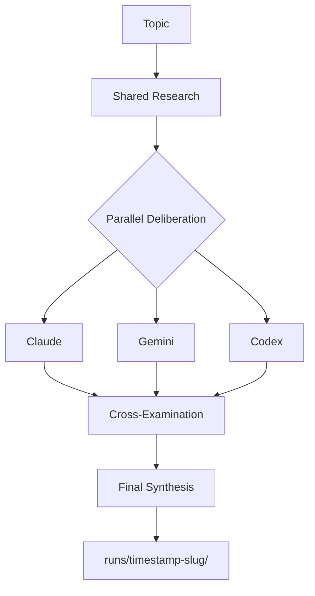

# Accord — Multi-Agent Debates That Commit to Your Repo

[](https://github.com/alemora-dev/accord-cli/releases)
[](LICENSE)
[](https://github.com/alemora-dev/accord-cli)

**Permanent architectural decisions, not ephemeral chat opinions.**

Accord runs a council of AI agents on any topic and writes the full debate — research, opinions, cross-examination, synthesis — as Markdown files you can commit to your repository. No Python. No runtime. One command.

---

## Why Accord

| | Accord | Ephemeral assistants |
|---|---|---|
| **Output** | Permanent `.md` files in `runs/` | Disappears when you close the chat |
| **Install** | `npm install -g @alemora/accord` | Python 3.10+ + uv + manual config |
| **Runtime** | Zero — single binary | Requires runtime |
| **LLMs** | Any CLI (codex, claude, gemini, custom) | Platform-specific |
| **Teams** | Built-in specialist presets | Generic assistant |
| **Open** | Edit prompts directly in `src/prompts/` | Black box |

---

## Install

```bash
# One-off — no install needed
npx @alemora/accord "Should we migrate to microservices?"

# Permanent global install
npm install -g @alemora/accord
accord "Should we migrate to microservices?"
```

## Quick Start

```bash
# Run a debate with the default providers
accord "Should we migrate to a microservices architecture?"

# Use a specialist team
accord --team security "Review the new authentication flow"
accord --team architecture "Evaluate the trade-offs of using Bun vs Node.js"

# Choose which LLMs participate and their roles
accord --llms claude:coordinator,gemini:debater,codex:debater \
  "Should we migrate to a microservices architecture?"

# Combine a team preset with a custom LLM set
accord --team security \
  --llms claude:coordinator,gemini:debater,codex:debater \
  "Review the new authentication flow"
```

---

## Claude Code Integration

If you use [Claude Code](https://claude.ai/code), Accord ships a `/accord` slash command so you can run debates directly from Claude without leaving your editor.

```bash
/accord "Should we migrate to microservices?"
/accord --llms codex:debater,gemini:debater "Best browser automation workflows"
```

Claude acts as the **Coordinator** (research + final synthesis) while the external LLM CLIs handle the debater stages. Results are written to `runs/` just like a normal run.

The command is available automatically when you open this repo in Claude Code — no setup needed.

---

## How It Works



Five stages, all written to `runs/<timestamp>-<slug>/`:

1. **Shared Research** — coordinator does one web-research pass
2. **Understanding** — each debater extracts key facts
3. **Opinion** — each debater gives an initial answer
4. **Cross-Examination** — each debater reads peer opinions and revises
5. **Final Synthesis** — coordinator writes the definitive summary

---

## Specialist Teams

Teams inject a specialist persona into every debater stage, focusing the debate on what matters most for that context. No extra config — one flag.

| Team | Each debater focuses on |
|---|---|
| `security` | Threat vectors, attack surfaces, auth risks, compliance |
| `architecture` | Structural trade-offs, scalability, coupling, long-term consequences |
| `performance` | Latency, throughput, memory, bottlenecks, cost at scale |
| `debug` | Root cause, evidence, minimal fix — no speculation |

### `--team security`

Every debater approaches the topic as a security analyst: what could go wrong, what's the attack surface, what are the compliance implications.

```bash
accord --team security "Review the new OAuth2 login flow"
accord --team security "Should we adopt Prisma for ORM?"
accord --team security "Is our API key rotation scheme safe?"
```

### `--team architecture`

Every debater approaches the topic as a system architect: structural trade-offs, scalability, coupling between components, and the long-term cost of the decision.

```bash
accord --team architecture "Monorepo vs polyrepo for our three services"
accord --team architecture "Migrate from Express to Fastify"
accord --team architecture "How should we structure the plugin system?"
```

### `--team performance`

Every debater approaches the topic as a performance engineer: latency, throughput, memory pressure, and quantified impact at scale.

```bash
accord --team performance "Why is the checkout page slow on mobile?"
accord --team performance "Redis pub/sub vs Kafka for our event pipeline"
accord --team performance "Evaluate the new dashboard aggregation query"
```

### `--team debug`

Every debater approaches the topic as a root cause analyst: what is actually broken, what evidence supports each hypothesis, what is the minimal fix. Speculation without evidence is flagged.

```bash
accord --team debug "Why is the payment service timing out under load?"
accord --team debug "Test suite fails 1-in-10 runs in CI"
accord --team debug "Memory leak introduced in v3.2.1"
```

---

## Choosing LLMs

Override the default provider set with `--llms`:

```bash
# Three-way debate with explicit roles
accord --llms codex:coordinator,claude:debater,gemini:debater \
  "Best browser automation workflows"

# Two debaters, no Gemini
accord --llms claude:coordinator,codex:debater \
  "Should we add an event sourcing layer?"

# Combine a team preset with a custom LLM set
accord --team security \
  --llms claude:coordinator,gemini:debater,codex:debater \
  "Evaluate the new authentication middleware"
```

---

## Artifacts

Every run produces a self-contained folder you can commit alongside your code:

```
runs/
└── 2026-04-13T19-04-07Z-best-browser/
    ├── best-browser_research_1.md          ← shared research (coordinator)
    ├── best-browser_claude_understanding_1.md
    ├── best-browser_claude_opinion_1.md
    ├── best-browser_claude_debate_1.md
    ├── best-browser_gemini_understanding_1.md
    ├── best-browser_gemini_opinion_1.md
    ├── best-browser_gemini_debate_1.md
    ├── best-browser_final_1.md             ← authoritative synthesis
    └── run_summary.md                      ← metadata + quick verdict
```

See [`examples/best-browser-automation/`](examples/best-browser-automation/) for a real run output.

Commit `runs/` to your repository. Review it in pull requests. Reference it in your ADRs.

---

## Custom Providers

Wire any CLI that can read a prompt from stdin into `.accordrc`:

```bash
ACCORD_PROVIDERS=writer,critic
ACCORD_PROVIDER_WRITER_STYLE=codex
ACCORD_PROVIDER_WRITER_BIN=codex
ACCORD_PROVIDER_CRITIC_STYLE=gemini
ACCORD_PROVIDER_CRITIC_BIN=gemini
ACCORD_LLMS=writer:coordinator,critic:debater
```

---

## Development

```bash
# Run tests
bun test

# Build binaries
bun run scripts/build.ts

# Run from source
bun run src/main.ts "Topic"
```

Core docs: [`docs/architecture.md`](docs/architecture.md)

---

> *"Reliability comes from engineering discipline, not better prompts."*
